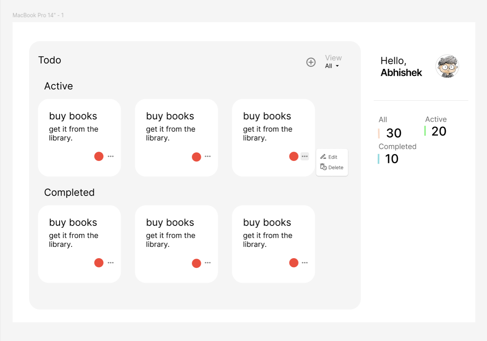

# Todo App

A responsive Todo application built with **React**, **TypeScript**, and **Vite**.


### Design 

figma file - https://www.figma.com/design/WuCc7c5WCTjTm8k1pnpjCH/Ziva-Assignment?node-id=0-1&t=ti7j6slqlb4Nodlf-1

## Features

- Add, edit, and delete todos
- Mark todos as completed or active
- Filter todos by status (all, completed, pending)
- Priority indicator for each todo
- Responsive design (two-column layout on mobile)
- Dialogs for adding, editing, and user setup
- Local storage persistence
- User profile section

## Project Structure

```
src/
  components/        # React components (Todo, Dialogs, Profile, etc.)
  styles/            # Component-specific CSS files
  types/             # TypeScript types
  App.tsx            # Main app logic
  main.tsx           # Entry point
public/
  ...
```

## Getting Started

1. **Install dependencies:**
   ```bash
   npm install
   ```

2. **Run the development server:**
   ```bash
   npm run dev
   ```

3. **Build for production:**
   ```bash
   npm run build
   ```

## Customization

- **Styling:**  
  Styles are organized in `src/styles/` for each component.  
  Global and layout styles are in `App.css`.

- **Dialogs:**  
  Dialogs for adding/editing todos and user setup use their own CSS for consistent UI.

- **Responsiveness:**  
  The todo grid switches to two columns on small screens for better usability.

## Tech Stack

- [React](https://react.dev/)
- [TypeScript](https://www.typescriptlang.org/)
- [Vite](https://vitejs.dev/)
- [Lucide Icons](https://lucide.dev/)
- [react-hot-toast](https://react-hot-toast.com/)

